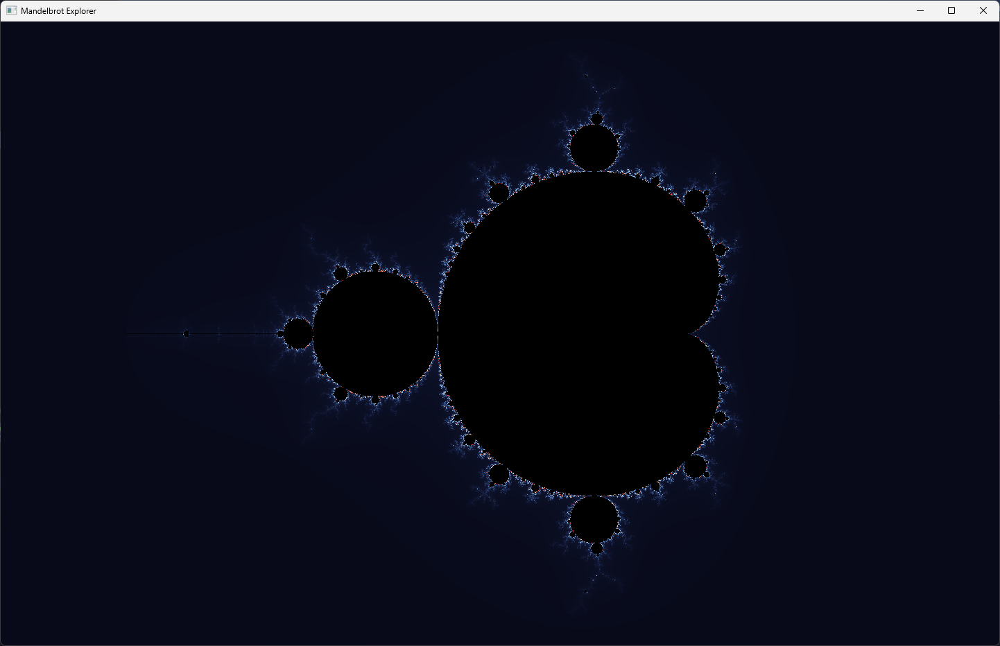

# Mandelbrot Explorer

A C++ implementation to calculate and visualize the Mandelbrot set, developed as a student project.

## Project Overview
This project provides a straightforward way to compute the Mandelbrot set. The focus was on implementing the mathematical logic behind fractal generation, handling complex numbers, and ensuring a clean code structure.

## Technical Details
*   **Language:** C++
*   **Approach:** Implements the classic Mandelbrot set [escape-time algorithm](https://en.wikipedia.org/wiki/Plotting_algorithms_for_the_Mandelbrot_set).
* Implemented using [SFML project template.](https://github.com/SFML/cmake-sfml-project)

## Getting Started

### Prerequisites
*   **C++ Compiler**
*   **CMake 3.22 or newer**

On Ubuntu, install the compiler, CMake, Git, and the native libraries needed to build SFML:
```bash
sudo apt update
sudo apt install build-essential cmake git \
    libx11-dev libxrandr-dev libxcursor-dev libxi-dev libudev-dev \
    libgl1-mesa-dev libegl1-mesa-dev libfreetype-dev libharfbuzz-dev
```

### Building the Project
1. Clone the repository:
```bash
git clone https://github.com/farnam-jhn/MandelbrotExplorer.git
cd MandelbrotExplorer
```
2. Create a build directory and compile:
```bash
mkdir build
cd build
cmake ..
cmake --build .
```

## Other docs
See [Documents folder](docs) for more details on the project.

## Screenshots

